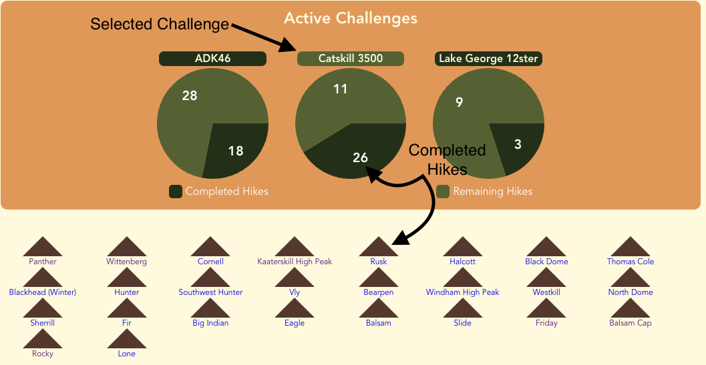
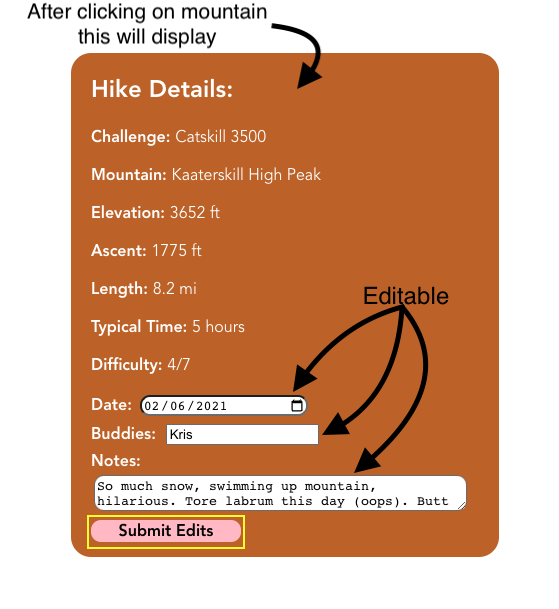
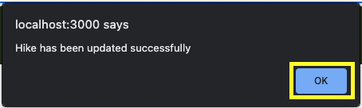

# Hiking Tracker

## [Demo Link](https://youtu.be/TUFJXX7V0jo) ##

## Description

We have created The Hiking Tracker. It allows hikers to more easily keep track of which mountains they have completed within their challenges in a simple and visual way. Currently, you have 5 challenges you can choose from and track, with the ability to add a newly completed mountain, as well as add the date, who you went with, or any general notes you would like to add about the hike.

Once you submit the new mountain, you will then see the corresponding pie chart update and give a visual representation of how many mountains you have completed, and also how many mountains are remaining to complete the challenge. From there you have the ability to click into each challenge - which will be indicated by a highlighted title - and it will diplay all completed mountains for that challenge below. 

From here you are able to click on any of these mountains, and it will bring you to a new page where the selected moutain info - as well as your form information from the hike will be displayed and also editable. This way if you would like to update notes, or correct an error you made on the submission you can do it right from this page. 

Once done viewing, you can press back - or if you made any edits to the form - then hit the "Submit Edits" button and you will get an alert in the window once the moutain is updated. when you click "OK" on the alert you will then be redirected back to the home page where you can begin to create new submissions or review other challenges.

this app is built by <b>Allie Soldau</b> and <b>Kevin Dutzy</b> using react, we created our own database with all the mountains and information. we also did all the CSS which are in box index.css and app.css. We are very satisfied with how this turned out and plan to add updates and refine it over the coming months to turn it into a fully functional app with a login, ways to add new challenges, and other features that everyone can use and enjoy.

This project was bootstrapped with [Create React App](https://github.com/facebook/create-react-app).

## Available Scripts

In the project directory, you can run:

### `npm start`

Runs the app in the development mode.\
Open [http://localhost:3000](http://localhost:3000) to view it in your browser.

The page will reload when you make changes.\
You may also see any lint errors in the console.

### `npm test`

Launches the test runner in the interactive watch mode.\
See the section about [running tests](https://facebook.github.io/create-react-app/docs/running-tests) for more information.

### `npm run build`

Builds the app for production to the `build` folder.\
It correctly bundles React in production mode and optimizes the build for the best performance.

The build is minified and the filenames include the hashes.\
Your app is ready to be deployed!

See the section about [deployment](https://facebook.github.io/create-react-app/docs/deployment) for more information.

### `npm run eject`

**Note: this is a one-way operation. Once you `eject`, you can't go back!**

If you aren't satisfied with the build tool and configuration choices, you can `eject` at any time. This command will remove the single build dependency from your project.

Instead, it will copy all the configuration files and the transitive dependencies (webpack, Babel, ESLint, etc) right into your project so you have full control over them. All of the commands except `eject` will still work, but they will point to the copied scripts so you can tweak them. At this point you're on your own.

You don't have to ever use `eject`. The curated feature set is suitable for small and middle deployments, and you shouldn't feel obligated to use this feature. However we understand that this tool wouldn't be useful if you couldn't customize it when you are ready for it.

## Learn More

You can learn more in the [Create React App documentation](https://facebook.github.io/create-react-app/docs/getting-started).

To learn React, check out the [React documentation](https://reactjs.org/).

### Code Splitting

This section has moved here: [https://facebook.github.io/create-react-app/docs/code-splitting](https://facebook.github.io/create-react-app/docs/code-splitting)

### Analyzing the Bundle Size

This section has moved here: [https://facebook.github.io/create-react-app/docs/analyzing-the-bundle-size](https://facebook.github.io/create-react-app/docs/analyzing-the-bundle-size)

### Making a Progressive Web App

This section has moved here: [https://facebook.github.io/create-react-app/docs/making-a-progressive-web-app](https://facebook.github.io/create-react-app/docs/making-a-progressive-web-app)

### Advanced Configuration

This section has moved here: [https://facebook.github.io/create-react-app/docs/advanced-configuration](https://facebook.github.io/create-react-app/docs/advanced-configuration)

### Deployment

This section has moved here: [https://facebook.github.io/create-react-app/docs/deployment](https://facebook.github.io/create-react-app/docs/deployment)

### `npm run build` fails to minify

This section has moved here: [https://facebook.github.io/create-react-app/docs/troubleshooting#npm-run-build-fails-to-minify](https://facebook.github.io/create-react-app/docs/troubleshooting#npm-run-build-fails-to-minify)
